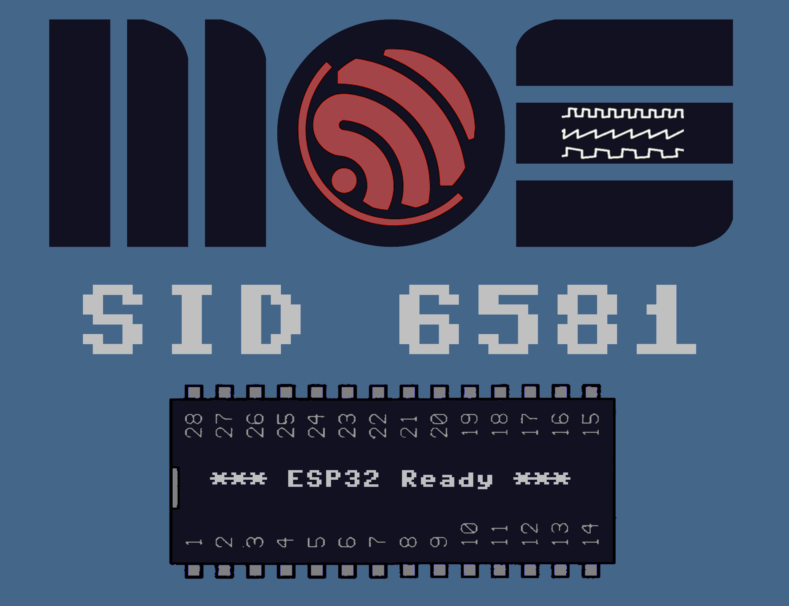

# SID 6581 library

[](https://www.ardu-badge.com/SID6581-targz)


An ESP32 library to control up to 5 SID 6581 chips from the 1980s era.


<p align="center">

</p>


Hardware requirements
---------------------
- ESP32-Wroom of ESP32-Wrover (dual core required)
- Any SID Chip model (original, clone)
- Any pcb using 74HC595 adressing (see [schematics](extras/Schematic_SIDESP32_Sheet_1_20200319160853.png)


Features
--------
- Directly push the register to the  SID chip. Hence you can program like in the good old times :)
- Play old (or new) sid tunes [video here](https://youtu.be/_N8GZVB5zfM)
- Play notes over up to 15 voices (3 voices per SID chip)
- Design and play different instruments [video here with MIDI and 6 voices](https://youtu.be/iHB7V7PAqJQ)
- Assign up to one instrument per voice

The sound is played in the background so your mcu can do something else at the same time.


NB: the SID chip requires a 1Mhz clock signal to work  **you can either provide it with an external clock circuit or use a pin of the esp32 to do it**  (clock generated thanks to I2s).

It should work with other mcu as it uses SPI but this hasn't been tested yet (contributors welcome).

Please look at the schematics for the setup of the shift registers. [MOS 6581 documentation](http://archive.6502.org/datasheets/mos_6581_sid.pdf ).

## To start
```C

// if you have a external oscillator that gives you the 1Mhz clock you can use:
begin(int clock_pin,int data_pin, int latch);

// if you do not have an external oscillator the esp32 can create the 1Mhz signal uisng i2s using this
begin(int clock_pin,int data_pin, int latch,int sid_clock_pin);
// the sid_clock_pin will need to be plugged to the 02 pin or clock pin of the SID 6581
// !!! NB: this pin number has to be >=16

```

# Playing SID tunes

You have to ways of playing sid tunes:

  1) Playing .sid files (PSID for the moment) the player is still under development so if you have issues do not hesistate to link the file which you have encountered issues with
  2) Playing registers dump

## 1 - To play a SIDTune from a .sid file (PSID version only for the moment)

You can play SIDTunes stored as .sid files ont the SPIFFS or SD card
Below the list of command to control the player

NB1: the sid tunes do not have an end hence they will play by default for 3 minutes. To stop a song you need to use stop()

```C
begin(int clock_pin,int data_pin, int latch);
begin(int clock_pin,int data_pin, int latch,int sid_clock_pin);
bool playSID();
bool playSID( SID_Meta_t* sid_info );
void soundOff(); //cut off the sound
void soundOn(); //trun the sound on
void togglePause(); //pause/play the player
void setMaxVolume( uint8_t volume); //each sid tunes usually set the volume this function will allow to scale the volume
void stop(); //stop the current song restart with playNext() or playPrev()
void setDefaultDuration(uint32_t duration); //will set the default duration of a track in milliseconds
uint32_t getDefaultDuration();

void setLoopMode(loopmode mode); //set the loop mode for playing the tracks and files
loopmode getLoopMode(); // returns the current loop mode
```

Possible `loopmode` values:

  - `SID_LOOP_ON`: loop inside a SID track, whatever the number of subsongs
  - `SID_LOOP_RANDOM` : same as SID_LOOP_ON with random selection of the next song in the SID track
  - `SID_LOOP_OFF` : ends after playing one song in the SID track


```C

~~bool getPlayerStatus(); //tells you if the runner is playing or not~~

bool isPlaying();

// Specific functions to have info on the current sid file
char * getFilename(); //return the filename of the current Sidfile playing
char * getName(); //get name of the current sid file
char * getPublished(); //get publish information of the current sid file
char * getAuthor(); //return the author of the current sidfile
uint32_t getCurrentTrackDuration(); //give you the duration of the current track
uint32_t getElapseTime(); //send you back the elapstimea track was played in milliseconds
int getNumberOfTunesInSid(); //get the number of tunes in a sidfile
int getCurrentTuneInSid(); // get the number of the current playing tunes in the sid (NB: the tunes are from 0->getNumberOfTunesInSid()-1
int getDefaultTuneInSid(); //get the number of the default tunes.

// SID Meta information

struct SID_Meta_t
{

  char     filename[255]; // This eliminates SPIFFS which is limited to 32 chars
  uint8_t  name[32];      // Song title
  uint8_t  author[32];    // Original author
  char     md5[32];       // The MD5 hash according to HVSC MD5 File
  uint8_t  published[32]; // This is NOT a copyright
  uint8_t  subsongs;      // How many subsongs in this track (up to 255)
  uint8_t  startsong;     // Which song should be played first
  uint32_t *durations = nullptr; // up to 255 durations in a song

};

```
By default the song duration is 3 minutes and can be changed with `setDefaultDuration(uint32_t duration)`.
You can retrieve the actual song durations from [https://www.hvsc.de](https://www.hvsc.de) archives. `DOCUMENTS/Songlengths.md5`.
If you have that file you can match the actual song duration with `getDuration( SID_Meta_t *song )`.


Example:

```C

#include <FS.h>
#include <SD.h>

#define SID_CLOCK 25
#define SID_DATA 33
#define SID_LATCH 27
#define SID_PLAYER
#define SID_INSTRUMENTS

#include <SID6581.h>


static MD5Archive HSVC =
{
  "HVSC 74",    // just a fancy name
  "HVSC-74"     // !! a dotfile name will be derivated from that
};

static MD5FileConfig MD5Config =
{
  &SD,                                   // The filesystem (reminder: SPIFFS is limited to 32 chars paths)
  &HVSC,                                 // High Voltage SID Collection meta info
  "/C64Music",                           // Folder where the HVSC unzipped contents can be found
  "/md5",                                // Folder where MD5 pre-parsed files will be spreaded (SD only)
  "/C64Music/DOCUMENTS/Songlengths.md5", // Where the MD5 file can be found (a custom/shorter file may be specified)
  "/md5/Songlengths.md5.idx",            // Where the Songlengths file will be indexed (SD only)
  MD5_INDEX_LOOKUP,                      // one of MD5_RAW_READ (SPIFFS), MD5_INDEX_LOOKUP (SD), or MD5_RAINBOW_LOOKUP (SD)
  nullptr                                // callback function for progress when the cache init happens, can be overloaded later
};


SIDTunesPlayer *player;

void setup() {

  Serial.begin(115200);

  player = new SIDTunesPlayer( &MD5Config );

  player->begin( SID_CLOCK, SID_DATA, SID_LATCH );

  if(!SD.begin()){
    Serial.println("SD Mount Failed");
    return;
  }

  if( !player->getInfoFromSIDFile( "/C64Music/MUSICIANS/H/Hubbard_Rob/Synth_Sample_III.sid" ) ) {
    Serial.println("SID File is not readable!");
    while(1);
  }

  player->play();

  Serial.println();
  Serial.printf("author:%s\n",player->getAuthor());
  Serial.printf("published:%s\n",player->getPublished());
  Serial.printf("name:%s\n",player->getName());
  Serial.printf("nb tunes:%d default tunes:%d\n",player->getNumberOfTunesInSid(),player->getDefaultTuneInSid());

  delay(5000);
  player->playNextSongInSid();
  delay(5000);
  Serial.println();
  Serial.printf("author:%s\n",player->getAuthor());
  Serial.printf("published:%s\n",player->getPublished());
  Serial.printf("name:%s\n",player->getName());
  Serial.printf("nb tunes:%d default tunes:%d\n",player->getNumberOfTunesInSid(),player->getDefaultTuneInSid());

}


void loop() {
    delay(5000);
    Serial.println("Pause the song");
    player->togglePause();
    delay(4000);
    Serial.println("restart the song");
    player->togglePause();
    delay(3000);
    Serial.println("hi volume");
    player->setMaxVolume(15);
    delay(3000);
    Serial.println("low volume ");
    player->setMaxVolume(3);
    delay(3000);
    Serial.println("medium");
    player->setMaxVolume(7);
    delay(6000);
}

```


## 2 - callback events of the players

Both players can fire custom events for better control:

```C
inline void setEventCallback(void (*fptr)(sidEvent event))
```
possible values of the event

  - `SID_NEW_TRACK` : playing new song
  - `SID_NEW_FILE` : playing a new file
  - `SID_START_PLAY` : start the player
  - `SID_END_PLAY` : end the player
  - `SID_PAUSE_PLAY` :pause track
  - `SID_RESUME_PLAY` : resume track
  - `SID_END_TRACK` : end of a track
  - `SID_STOP_TRACK`: stop the current trak

Example:

```C

#define SID_CLOCK 25
#define SID_DATA 33
#define SID_LATCH 27
#define SID_PLAYER
#define SID_INSTRUMENTS
#include <SD.h>
#include <FS.h>
#include <SID6581.h>

SIDRegisterPlayer * player;

void myCallback(  sidEvent event ) {
    switch( event ) {
        case SID_NEW_TRACK:
            Serial.printf( "New track: %s\n",player->getFilename() );
        break;
        case SID_START_PLAY:
            Serial.printf( "Start play: %s\n",player->getFilename() );
        break;
        case SID_END_PLAY:
            Serial.printf( "stopping play: %s\n",player->getFilename() );
        break;
        case SID_PAUSE_PLAY:
            Serial.printf( "pausing play: %s\n",player->getFilename() );
        break;
        case SID_RESUME_PLAY:
            Serial.printf( "resume play: %s\n",player->getFilename() );
        break;
        case SID_END_SONG:
            Serial.println("End of track");
        break;
    }
}

void setup() {
    Serial.begin(115200);
    player=new SIDRegisterPlayer();
    player->begin(SID_CLOCK,SID_DATA,SID_LATCH);
    player->setEventCallback(myCallback);
    if(!SPIFFS.begin(true)){
        Serial.println("SPIFFS Mount Failed");
        return;
    }
    //the following line will go through all the files in the SPIFFS
    //Do not forget to do "Tools-> ESP32 Scketch data upload"
    File root = SPIFFS.open("/");
    if(!root){
        Serial.println("- failed to open directory");
        return;
    }
    if(!root.isDirectory()){
        Serial.println(" - not a directory");
        return;
    }
    File file = root.openNextFile();
    while(file){
        if(file.isDirectory()){

        } else {
            Serial.print(" add file  FILE: ");
            Serial.print(file.name());
            Serial.print("\tSIZE: ");
            Serial.println(file.size());
            player->addSong(SPIFFS,file.name()); //add all the files on the root of the spiff to the playlist
        }
        file = root.openNextFile();
    }
    player->SetMaxVolume(7); //value between 0 and 15
    player->play(); //it will play all songs in loop
}

void loop() {
    //if you jsut want to hear the songs just comment the lines below
    delay(10000);
    player->pausePlay();
    delay(8000);
    //  Serial.println("restart the song");
    player->pausePlay();
    delay(3000);
    Serial.println("next song");
    player->playNext(); //sid.playPrev(); if you want to go backwards
}
```

## 4 - Example to control the Player using GPIOs

See the `SIDPlayerControl.ino` sketch in the `Examples` folder.

# Directly control the SID chip via register

You have full control of the SID chip via the following commands

## 1 - Set the registers

```C
void sidSetVolume( uint8_t chip,uint8_t vol); set the volume off a specific SID chip (start with 0);
// below the chip number is deduced using the voice number (start with 0)
// chip number = voice/3
// voice on the chip = voice%3
// hence if you have two chips, if voice=4,  sid.setFrequencyHz(voice, 440) will put 440Hz on the 2nd  voice of the chip n°1
void setFrequency(int voice, uint16_t frequency); //this function set the 16 bit frequency is is not the frequency in Hertz
// The frequency is determined by the following equation:
// Fout = (Fn * Fclk/16777216) Hz
// Where Fn is the 16-bit number in the Frequency registers and Fclk is the system clock applied to the 02 input (pin 6). For a standard 1.0 Mhz clock, the frequency is given by:
// Fout = (Fn * 0.0596) Hz
void setFrequencyHz(int voice,double frequencyHz); //Use this function to set up the frequency in Hertz ex:setFrquencyHz(0,554.37) == setFrequency(0,9301)
void setPulse(int voice, uint16_t pulse);
void setEnv(int voice, uint8_t att,uint8_t decay,uint8_t sutain, uint8_t release);
void setAttack(int voice, uint8_t att);
void setDecay(int voice, uint8_t decay);
void setSustain(int voice,uint8_t sutain);
void setRelease(int voice,uint8_t release);
void setGate(int voice, int gate);
void setWaveForm(int voice,int waveform);
```

Available waveforms:

  - `SID_WAVEFORM_TRIANGLE`
  - `SID_WAVEFORM_SAWTOOTH`
  - `SID_WAVEFORM_PULSE`
  - `SID_WAVEFORM_NOISE`

```C
void setTest(int voice,int test);
void setSync(int voice,int sync);

void setRingMode(int voice, int ringmode);
void setFilterFrequency(int chip,int filterfrequency);
void setResonance(int chip,int resonance);
void setFilter1(int chip,int filt1);
void setFilter2(int chip,int filt2);
void setFilter3(int chip,int filt3);
void setFilterEX(int chip,int filtex);
void set3OFF(int chip,int _3off);
void setHP(int chip,int hp);
void setBP(int chip,int bp);
void setLP(int chip,int lp);
```

For advanced controls:

```C
void pushToVoice(int voice,uint8_t address,uint8_t data);
```

This function will allow you to push a data to a specific register of a specific voice

Example:

```C
sid.pushToVoice(0,SID_FREG_HI,255); //to push 255 on the register FREQ_HI of voice 0
```

Possible values:

  - `SID_FREQ_LO`
  - `SID_FREQ_HI`
  - `SID_PW_LO`
  - `SID_PW_HI`
  - `SID_CONTROL_REG`
  - `SID_ATTACK_DECAY`
  - `SID_SUSTAIN_RELEASE`
  - `SID_WAVEFORM_SILENCE`

```C
void pushRegister(uint8_t chip,int address,int data);
```

This function will allow you to push directly a value to a register of a specific chip
example:

```C
sid.pushRegister(0,SID_MOD_VOL,15) //will put the sound at maximum
```

Possible values:

  - `SID_FREQ_LO_0`
  - `SID_FREQ_HI_0`
  - `SID_PW_LO_0`
  - `SID_PW_HI_0`
  - `SID_CONTROL_REG_0`
  - `SID_ATTACK_DECAY_0`
  - `SID_SUSTAIN_RELEASE_0`
  - `SID_FREQ_LO_1`
  - `SID_FREQ_HI_1`
  - `SID_PW_LO_1`
  - `SID_PW_HI_1`
  - `SID_CONTROL_REG_1`
  - `SID_ATTACK_DECAY_1`
  - `SID_SUSTAIN_RELEASE_1`
  - `SID_FREQ_LO_2`
  - `SID_FREQ_HI_2`
  - `SID_PW_LO_2`
  - `SID_PW_HI_2`
  - `SID_CONTROL_REG_2`
  - `SID_ATTACK_DECAY_2`
  - `SID_SUSTAIN_RELEASE_2`
  - `SID_FC_LO`
  - `SID_FC_HI`
  - `SID_RES_FILT`
  - `SID_MOD_VOL`

⚠️ `sid.pushToVoice(0,SID_FREG_HI,255)` == `sid.pushRegister(0,SID_FREQ_HI_0,255)`


```C
void resetsid();
```

This function will reset all the SID chips

Example

```C

#define SID_CLOCK 25
#define SID_DATA 33
#define SID_LATCH 27
#define SID_PLAYER
#define SID_INSTRUMENTS
#include <SD.h>
#include <FS.h>
#include <SID6581.h>

void setup() {
    Serial.begin(115200);
    sid.begin(SID_CLOCK,SID_DATA,SID_LATCH);
    sid.sidSetVolume(0,15);
    sid.setGate(0,1);//if not set you will not hear anything
    sid.setAttack(0,1);
    sid.setSustain(0,15);
    sid.setDecay(0,1);
    sid.setRelease(0,1);
    sid.setPulse(0,512);
    sid.setWaveForm(0,SID_WAVEFORM_TRIANGLE);
}

void loop() {
    sid.setWaveForm(0,SID_WAVEFORM_TRIANGLE);
    for(int i=0;i<255;i++) {
        sid.setFrequency(0,i+(255-i)*256);
        delay(10);
    }
    sid.setWaveForm(0,SID_WAVEFORM_PULSE);
    for(int i=0;i<5000;i++) {
        sid.setFrequency(0,i%255+(255-i%255)*256);
        float pulse=1023*(cos((i*3.14)/1000)+1)+2047;
        sid.setPulse(0,(int)pulse);
        delayMicroseconds(1000);
    }
}
```


## 2 - Read the registers

Getters to read the value of the registers

```C
int getSidVolume( int chip);
int getFrequency(int voice);
double getFrequencyHz(int voice);
int getPulse(int voice);
int getAttack(int voice);
int getDecay(int voice);
int getSustain(int voice);
int getRelease(int voice);
int getGate(int voice);
int getWaveForm(int voice);
```

Possible waveform values are:

  - `SID_WAVEFORM_TRIANGLE`
  - `SID_WAVEFORM_SAWTOOTH`
  - `SID_WAVEFORM_PULSE`
  - `SID_WAVEFORM_NOISE`
  - `SID_WAVEFORM_SILENCE`

```C
int getTest(int voice);
int getSync(int voice);
int getRingMode(int voice);
int getFilterFrequency(int chip);
int getResonance(int chip);
int getFilter1(int chip);
int getFilter2(int chip);
int getFilter3(int chip);
int getFilterEX(int chip);
int get3OFF(int chip);
int getHP(int chip);
int getBP(int chip);
int getLP(int chip);
```

Global function:

```C
int getRegister(int chip,int addr);
```

Here are the  possible addresses:

  - `SID_FREQ_LO_0`
  - `SID_FREQ_HI_0`
  - `SID_PW_LO_0`
  - `SID_PW_HI_0`
  - `SID_CONTROL_REG_0`
  - `SID_ATTACK_DECAY_0`
  - `SID_SUSTAIN_RELEASE_0`
  - `SID_FREQ_LO_1`
  - `SID_FREQ_HI_1`
  - `SID_PW_LO_1`
  - `SID_PW_HI_1`
  - `SID_CONTROL_REG_1`
  - `SID_ATTACK_DECAY_1`
  - `SID_SUSTAIN_RELEASE_1`
  - `SID_FREQ_LO_2`
  - `SID_FREQ_HI_2`
  - `SID_PW_LO_2`
  - `SID_PW_HI_2`
  - `SID_CONTROL_REG_2`
  - `SID_ATTACK_DECAY_2`
  - `SID_SUSTAIN_RELEASE_2`
  - `SID_FC_LO`
  - `SID_FC_HI`
  - `SID_RES_FILT`
  - `SID_MOD_VOL`

Example:

```C
void loop() {
    Serial.printf("Frequency voice 1:%d voice 2:%d voice 3:%d\n",sid.getFrequency(0),sid.getFrequency(1),sid.getFrequency(2));
    Serial.printf("Waveform voice 1:%d voice 2:%d voice 3:%d\n",sid.getWaveForm(0),sid.getWaveForm(1),sid.getWaveForm(2));
    Serial.printf("Pulse voice 1:%d voice 2:%d voice 3:%d\n",sid.getPulse(0),sid.getPulse(1),sid.getPulse(2));
    vTaskDelay(100);
}
```


# Keyboard Player (SIDKeyBoardPlayer Class)

You can turn the SID Chip into a synthetizer with up to 15 voices depending on the number of sid chips you have.
The following commands will allow you to create instruments and simplify the creation of music. It can also be used for MIDI see example.

## To start the keyboard

```C
// all the function of the KeyBoardPlayer are static so always preceded by SIDKeyBoardPlayer::
SIDKeyBoardPlayer::KeyBoardPlayer(int number_of_voices);
```
## Play a note


All these commands will play a note on a specific voice for a certain duration:

  - `SIDKeyBoardPlayer::playNote(int voice,uint16_t note,int duration)`
  - `SIDKeyBoardPlayer::playNoteHz(int voice,int frequencyHz,int duration)`
  - `SIDKeyBoardPlayer::playNoteVelocity(int voice,uint16_t note,int velocity,int duration)` if you have an instrument that uses the velocity

ⓘ The duration is in milliseconds

Example:

```C

#define SID_CLOCK 25
#define SID_DATA 33
#define SID_LATCH 27
#define SID_PLAYER
#define SID_INSTRUMENTS
#include <SD.h>
#include <FS.h>
#include <SID6581.h>

void setup() {
    // initialize serial:
    Serial.begin(115200);
    sid.begin(SID_CLOCK,SID_DATA,SID_LATCH);
    SIDKeyBoardPlayer::KeyBoardPlayer(3);
    sid.sidSetVolume(0,15);
}

void loop() {
    SIDKeyBoardPlayer::playNoteHz(2,440,2000); //will play a A4 for 2 seconds
    while(SIDKeyBoardPlayer::isVoiceBusy(2)); //as the note are played in the background you need to wait a bit
    delay(1000);
}
```
You can play several voices at the same time

```C

#define SID_CLOCK 25
#define SID_DATA 33
#define SID_LATCH 27
#define SID_PLAYER
#define SID_INSTRUMENTS
#include <SD.h>
#include <FS.h>
#include <SID6581.h>

void setup() {
    // initialize serial:
    Serial.begin(115200);
    sid.begin(SID_CLOCK,SID_DATA,SID_LATCH);
    SIDKeyBoardPlayer::KeyBoardPlayer(6);
    sid.sidSetVolume(0,15);
    sid.sidSetVolume(1,15); //if you have two chips
}

void loop() {
    SIDKeyBoardPlayer::playNoteHz(2,440,6000);
    delay(1000);
    SIDKeyBoardPlayer::playNoteHz(0,880,2000);
    delay(500);
    SIDKeyBoardPlayer::playNoteHz(1,1760,2000);
    delay(500);
    SIDKeyBoardPlayer::playNoteHz(3,220,2000); //we will play on voice 0 of the second chip
    while(SIDKeyBoardPlayer::areAllVoiceBusy());
    delay(2000);
}
```

⚠️ If the duration is equal to 0, then the sound will not stop until you call the function stopNote.

```C

#define SID_CLOCK 25
#define SID_DATA 33
#define SID_LATCH 27
#define SID_PLAYER
#define SID_INSTRUMENTS
#include <SD.h>
#include <FS.h>
#include <SID6581.h>

void setup() {
    // initialize serial:
    Serial.begin(115200);
    sid.begin(SID_CLOCK,SID_DATA,SID_LATCH);
    SIDKeyBoardPlayer::KeyBoardPlayer(6);
    sid.sidSetVolume(0,15);
    sid.sidSetVolume(1,15); //if you have two chips
}

void loop() {
    SIDKeyBoardPlayer::playNoteHz(2,440,0);
    delay(1000);
    SIDKeyBoardPlayer::stopNote(2);
    delay(500);
}
```

## To change instrument

The library gives you the possibility to change instruments. There are 5 in 'store'.

1) To change the instruments for all voices:

```C++
changeAllInstruments<instrument>();
```
Possible values:

  - `sid_piano`
  - `sid_piano2`
  - `sid_piano3`
  - `sid_piano4`
  - `sid_piano5`


Example:

```C

#define SID_CLOCK 25
#define SID_DATA 33
#define SID_LATCH 27
#define SID_PLAYER
#define SID_INSTRUMENTS
#include <SD.h>
#include <FS.h>
#include <SID6581.h>

void playtunes() {
    for(int i=0;i<3;i++) {
        SIDKeyBoardPlayer::playNoteHz(0,220*(i+1),1500);
        while(SIDKeyBoardPlayer::isVoiceBusy(0));
        delay(100);
    }
}

void setup() {
    // initialize serial:
    Serial.begin(115200);
    sid.begin(SID_CLOCK,SID_DATA,SID_LATCH);
    SIDKeyBoardPlayer::KeyBoardPlayer(6);
    sid.sidSetVolume(0,15);
    sid.sidSetVolume(1,15); //if you have two chips

 }

void loop() {
    SIDKeyBoardPlayer::changeAllInstruments<sid_piano>();
    playtunes();
    SIDKeyBoardPlayer::changeAllInstruments<sid_piano2>();
    playtunes();
    SIDKeyBoardPlayer::changeAllInstruments<sid_piano3>();
    playtunes();
    SIDKeyBoardPlayer::changeAllInstruments<sid_piano4>();
    playtunes();
    SIDKeyBoardPlayer::changeAllInstruments<sid_piano5>();
    playtunes();
    delay(1000);
}
```

2) Change instrument for a specific voice

To change the instruments for all voices

```C
changeInstrumentOnVoice<instrument>(uint8_t voice);
```

Possible values:

  - `sid_piano`
  - `sid_piano2`
  - `sid_piano3`
  - `sid_piano4`
  - `sid_piano5`

Example:

```C

#define SID_CLOCK 25
#define SID_DATA 33
#define SID_LATCH 27
#define SID_PLAYER
#define SID_INSTRUMENTS
#include <SD.h>
#include <FS.h>
#include <SID6581.h>

void playtunes() {
    for(int i=0;i<3;i++) {
        SIDKeyBoardPlayer::playNoteHz(i,220*(i+1),1500); //playing each note on a specific voice
        while(SIDKeyBoardPlayer::isVoiceBusy(i));
        delay(100);
    }
}

void setup() {
    // initialize serial:
    Serial.begin(115200);
    sid.begin(SID_CLOCK,SID_DATA,SID_LATCH);
    SIDKeyBoardPlayer::KeyBoardPlayer(6);
    sid.sidSetVolume(0,15);
    sid.sidSetVolume(1,15); //if you have two chips
}

void loop() {
    SIDKeyBoardPlayer::changeAllInstruments<sid_piano2>();
    playtunes(); //all the voices will play the same instrument
    SIDKeyBoardPlayer::changeInstrumentOnVoice<sid_piano>(1);
    playtunes(); //ther second voice will be played with a different instrument
    delay(1000);
}
```


## To create an instrument
the library allows to create your own instruments, each instrument is a class

```C
class new_instrument : public sid_instrument {
  public:
    new_instrument(){
        //her goes the code to initialise your instrument
    }
    virtual void start_sample(int voice,int note){
        //here goes the code when the note starts
    }
    virtual void next_instruction(int voice,int note){
        //here goes the code when you're sustaining the note
    }
    virtual void after_off(int voice,int note){
        //here gies the code exucted during the release part of the note
    }
};
```

 To use the intrument:

 - `SIDKeyBoardPlayer::changeAllInstruments<new_instrument>();`
 - `SIDKeyBoardPlayer::changeInstrumentOnVoice<new_instrument>(int voice);`


1)  Simple instrument

 ```C

#define SID_CLOCK 25
#define SID_DATA 33
#define SID_LATCH 27
#define SID_PLAYER
#define SID_INSTRUMENTS
#include <SD.h>
#include <FS.h>
#include <SID6581.h>

void playtunes() {
    for(int i=0;i<3;i++) {
      SIDKeyBoardPlayer::playNoteHz(0,220*(i+1),1500);
      while(SIDKeyBoardPlayer::isVoiceBusy(0));
      delay(100);
    }
}

class new_instrument : public sid_instrument {
  public:
    virtual void start_sample(int voice,int note) {
        sid.setAttack(voice,0);
        sid.setSustain(voice,1);
        sid.setDecay(voice,10);
        sid.setRelease(voice,9);
        sid.setPulse(voice,3000);
        sid.setWaveForm(voice,SID_WAVEFORM_PULSE);
        sid.setFrequency(voice,note);
        sid.setGate(voice,1);
    }
};

void setup() {
    // initialize serial:
    Serial.begin(115200);
    sid.begin(SID_CLOCK,SID_DATA,SID_LATCH);
    SIDKeyBoardPlayer::KeyBoardPlayer(6);
    sid.sidSetVolume(0,15);
    sid.sidSetVolume(1,15); //if you have two chips
    SIDKeyBoardPlayer::changeAllInstruments<new_instrument>();
}
void loop() {
    playtunes();
    delay(1000);
}
```
2) Slightly more complicated use case:

```C

#define SID_CLOCK 25
#define SID_DATA 33
#define SID_LATCH 27
#define SID_PLAYER
#define SID_INSTRUMENTS
#include <SD.h>
#include <FS.h>
#include <SID6581.h>

void playtunes() {
    for(int i=0;i<3;i++) {
        SIDKeyBoardPlayer::playNoteHz(0,220*(i+1),1000);
        while(SIDKeyBoardPlayer::isVoiceBusy(0));
        delay(100);
    }
}

class new_instrument : public sid_instrument {
  public:

    int i;

    virtual void start_sample(int voice,int note) {
        sid.setAttack(voice,0);
        sid.setSustain(voice,5);
        sid.setDecay(voice,10);
        sid.setRelease(voice,12);
        sid.setPulse(voice,3000);
        sid.setWaveForm(voice,SID_WAVEFORM_PULSE);
        sid.setFrequency(voice,note);
        sid.setGate(voice,1);
        i=0;
    }

    virtual void next_instruction(int voice,int note) {
        sid.setPulse(voice, 3000+500*cos(2*3.14*i/10)); //we make the pulse vary each time
        vTaskDelay(30);
        i=(i+1)%10;
    }
};

void setup() {
    // initialize serial:
    Serial.begin(115200);
    sid.begin(SID_CLOCK,SID_DATA,SID_LATCH);
    SIDKeyBoardPlayer::KeyBoardPlayer(6);
    sid.sidSetVolume(0,15);
    sid.sidSetVolume(1,15); //if you have two chips
    SIDKeyBoardPlayer::changeAllInstruments<new_instrument>();
}

void loop() {
    playtunes();
    delay(1000);
}
```

 Here you can hear that during the release part (when the sound goes slowly down the wobling effect
 has disappeared. This is normal as the release will only take count of the last note played.
 To arrange that we can make use of the after_off function as such

 ```C

#define SID_CLOCK 25
#define SID_DATA 33
#define SID_LATCH 27
#define SID_PLAYER
#define SID_INSTRUMENTS
#include <SD.h>
#include <FS.h>
#include <SID6581.h>

void playtunes() {
    for(int i=0;i<3;i++) {
        SIDKeyBoardPlayer::playNoteHz(0,220*(i+1),1000);
        while(SIDKeyBoardPlayer::isVoiceBusy(0));
        delay(100);
    }
}

class new_instrument:public sid_instrument{
  public:
    int i;


    virtual void start_sample(int voice,int note) {
        sid.setAttack(voice,0);
        sid.setSustain(voice,5);
        sid.setDecay(voice,10);
        sid.setRelease(voice,12);
        sid.setPulse(voice,3000);
        sid.setWaveForm(voice,SID_WAVEFORM_PULSE);
        sid.setFrequency(voice,note);
        sid.setGate(voice,1);
        i=0;
    }

    virtual void next_instruction(int voice,int note) {
        sid.setPulse(voice, 3000+500*cos(2*3.14*i/10)); //we make the pulse vary each time
        vTaskDelay(30);
        i=(i+1)%10;
    }
    virtual void after_off(int voice,int note){
        next_instruction(voice,note); //we continue the wobbling
    }
};

void setup() {
    // initialize serial:
    Serial.begin(115200);
    sid.begin(SID_CLOCK,SID_DATA,SID_LATCH);
    SIDKeyBoardPlayer::KeyBoardPlayer(6);
    sid.sidSetVolume(0,15);
    sid.sidSetVolume(1,15); //if you have two chips
    SIDKeyBoardPlayer::changeAllInstruments<new_instrument>();
}

void loop() {
    playtunes();
    delay(1000);
}
```

 3) to go further, if you have sample from a sid as a set of register calls you can do this:

 ```C
class sid_piano : public sid_instrument {
  public:

    int i;
    int flo,fhi,plo,phi;
    uint16_t *df2;

    sid_piano() {
        df2=sample1;
    }
    virtual void start_sample(int voice,int note) {
        i=0;
    }
    virtual void next_instruction(int voice,int note) {
        i=(i+1)%1918;
        if(i==0)
          i=1651;
        switch(df2[i*3]) {
          case 0:
              flo=df2[i*3+1];
          break;
          case 1:
              fhi=df2[i*3+1];
              //i am modifyinhg the final note with rule if you do not modify this it will be always the same sound
              sid.setFrequency(voice,((fhi*256+flo)*note/7977));
          break;
          default:
              if(df2[i*3]<7)
              sid.pushRegister(voice/3,df2[i*3]+(voice%3)*7,df2[i*3+1]);
          break;
        }
        vTaskDelay(df2[i*3+2]/1000);
    }
};
 ```

# MIDI

See the `Examples` folder for a simple midi implementation.

To plug the Midi to the esp32 please look around internet it will depend on what is available around you. I use a 4N25 optocoupler but you could find a lot of different implementations.

ⓘ The numbers assigned to instruments are those found in my yamaha P-140 user guide.

# Credits & Thanks

- [tobozo](https://github.com/tobozo) for helping not only testing but giving me inputs, code review and readme.md correction as well as ideas for the functionalities to implements for the SID players.
    Please check his repo where he's using this library to implement not only a full player but also a [SID vizualizer](https://github.com/tobozo/ESP32-SIDView).

- [XadNightfall](https://github.com/XadNightfall) For implementing the undocumented opcodes and improving in the cpu emulator

- [Ken Händel](https://haendel.ddns.net/~ken/#_latest_beta_version) for his advices and his tools

- [jhohertz](https://github.com/jhohertz/jsSID) for his work on jsSID engine that I have reimplemented on C++

- Other inspiration like cSID


# Conclusions

1) Let me know if you're using the library
2) Do not hesitate if you have questions
3) Contributions warmly welcome !
